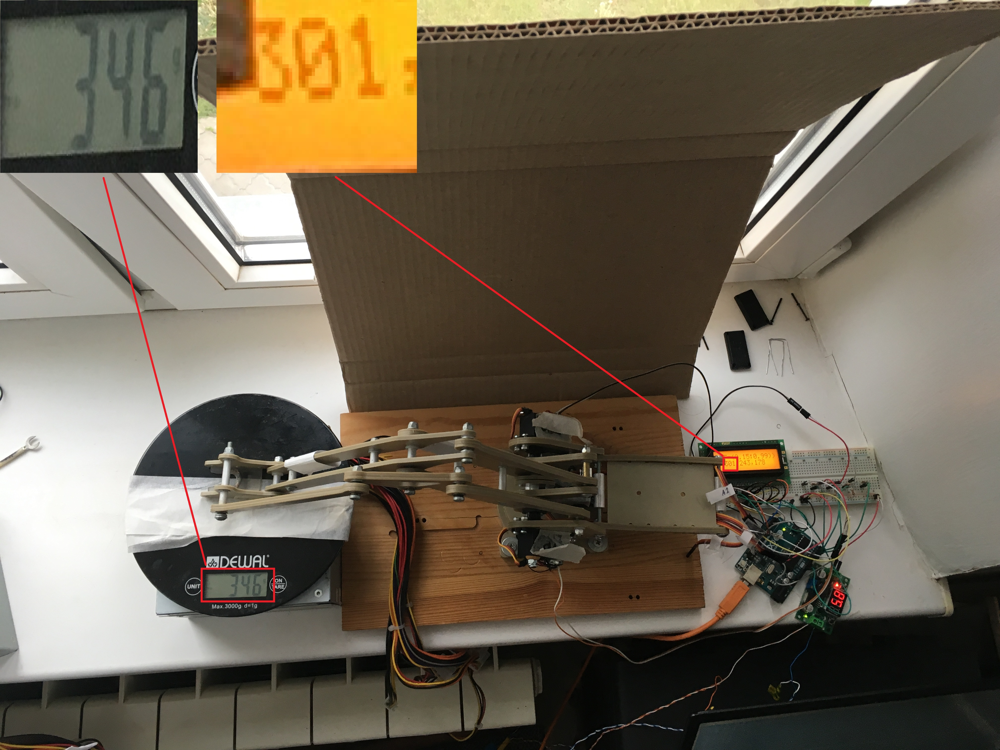

# Torques Forces sensor For 2DOF Manipulator
Project for sensoring torques and forces of 2DOF-Manipulator without torques and forces sensor. It measures torques and forces depending on the current that flows in the manipulator's servomotors.

  

